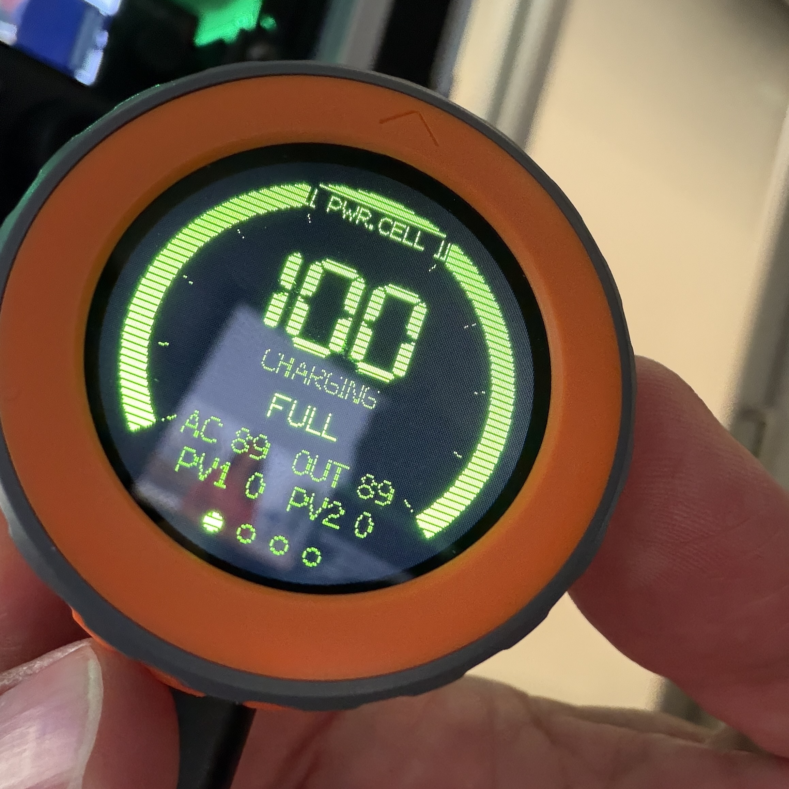

# EcoFlow Dial

A Pip-Boy-flavored remote monitor & controller for EcoFlow power stations
(built for the **Delta 2 Max**) running on an **M5Stack Dial** (ESP32-S3, 1.28"
round 240×240 TFT, rotary encoder).

Pulls live telemetry from the EcoFlow IoT Open API over WiFi and lets you
toggle AC output, set the charge limit, and adjust AC charge speed — all from
a knob you can stick on a shelf.

 <!-- add a photo here -->

## Features

- **Live status**: state of charge with a color-coded arc gauge (green → yellow
  → orange → red), charging/on-battery state, time-to-full / runtime remaining,
  and AC + dual-PV solar power flow.
- **Controls**: AC output on/off, max charge SoC, AC fast-charge wattage — each
  with a confirmation step for anything disruptive.
- **On-device setup**: WiFi and EcoFlow API keys are entered through a phone
  captive portal — no hardcoding required for shared units.
- **Reset menu**: wipe WiFi, device, API keys, or do a full factory reset
  independently.
- **Retro UI**: EF logo boot splash, CRT scanlines, and a subtle backlight
  "breathe."

## Hardware

- [M5Stack Dial](https://shop.m5stack.com/products/m5stack-dial-esp32-s3-smart-rotary-knob)
  (ESP32-S3, GC9A01 round display, rotary encoder)
- An EcoFlow power station on your account (developed against **Delta 2 Max**)

## Build & flash (Arduino IDE)

### Libraries (Library Manager)
- `M5Dial` (pulls in `M5Unified` + `M5GFX`)
- `WiFiManager` (by tzapu)
- `ArduinoJson`

### Board settings (Tools menu)
| Setting | Value |
|---|---|
| Board | `ESP32S3 Dev Module` |
| USB CDC On Boot | `Enabled` |
| USB Mode | `Hardware CDC and JTAG` |
| Upload Mode | `UART0 / Hardware CDC` |
| Flash Size | `8MB` |
| Partition Scheme | `Huge APP (3MB No OTA/1MB SPIFFS)` |
| PSRAM | `OPI PSRAM` |
| Upload Speed | `921600` |

> The `Huge APP` partition is required — the default scheme is too small.

### Keys
```bash
cp secrets.example.h secrets.h
```
Then edit `secrets.h` — see **Build modes** below.

## Build modes

`secrets.h` has a single toggle:

```c
#define PERSONAL_BUILD   // your own unit
```

- **Uncommented (personal):** paste your EcoFlow Access/Secret keys; they compile
  into the firmware and the dial never prompts for them.
- **Commented out (distribution):** keys compile to empty strings — nothing
  sensitive is baked into the binary. On first boot the dial prompts the user to
  enter *their own* keys via the captive portal, stored only in that unit's NVS.
  Use this for any unit you give to someone else.

Get keys from the [EcoFlow Developer Platform](https://developer.ecoflow.com)
(requires an approved developer account — one per EcoFlow account).

## First-boot setup

1. Dial broadcasts a WiFi AP named **`EcoFlow-Dial`**.
2. Connect your phone to it; the captive portal opens (or browse to `192.168.4.1`).
3. Enter your WiFi network + (on distribution builds) your EcoFlow API keys.
4. The dial connects, validates the keys, and shows a device picker.
5. Scroll to your device, press to select. Done — settings persist across reboots.

## Controls

| Screen | Rotate | Press |
|---|---|---|
| **STATUS** | next screen | enter CONTROLS |
| **CONTROLS** | (inactive) skip / (active) select row | enter / activate / adjust |
| **SYSTEM** | next screen | enter CONTROLS |
| **RESET** | (inactive) skip / (active) select option | enter / confirm wipe |

On CONTROLS: press to enter edit mode, scroll to a row, press to adjust its
value, scroll to change, press to confirm & send.

RESET options: `WIFI` · `DEVICE` · `API KEYS` · `FACTORY` — each behind a
YES/NO confirmation.

## Project layout

| File | Purpose |
|---|---|
| `ecoflow_dial.ino` | Main firmware |
| `secrets.h` | Your keys (gitignored) — copy from `secrets.example.h` |
| `logo.h` | EF boot-splash bitmap |
| `splash.h` | Splash drawing helpers |

## Notes

- Uses the EcoFlow **IoT Open Platform** HTTP API (HMAC-SHA256 signed). This is
  meant for device *owners* automating their own gear — there's no public OAuth,
  so each user needs their own API keys.
- The API is cloud-based; the dial needs internet. A local Bluetooth path exists
  in the community but isn't implemented here.

## License

MIT — see `LICENSE`.
